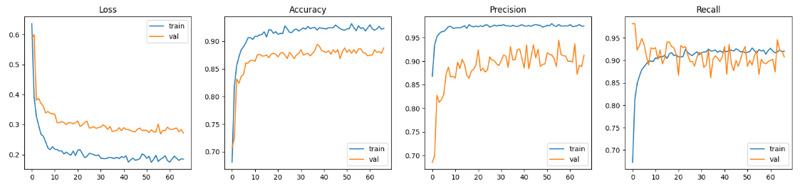
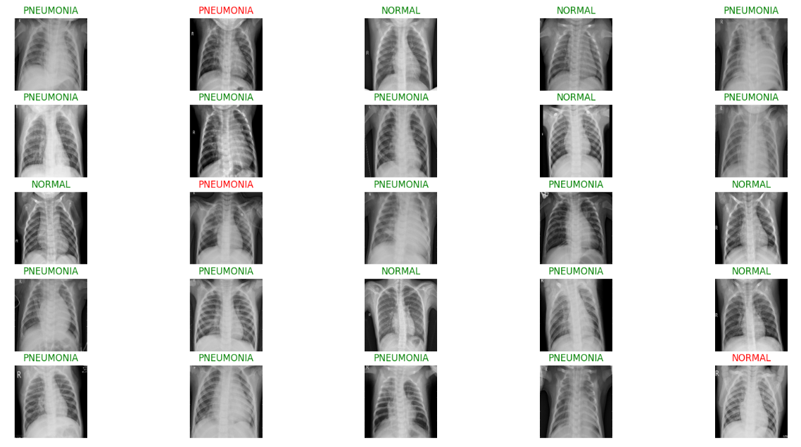

# Pneumonia Classifier

This is a simple deep learning project that detects pneumonia from chest X-ray images. It uses a pre-trained ResNet50 model fine-tuned on a public dataset from Kaggle.

## Overview

- **Goal:** Classify chest X-rays into two classes — *Pneumonia* or *Normal*.
- **Dataset:** [Chest X-Ray Images (Pneumonia) from Kaggle](https://www.kaggle.com/datasets/paultimothymooney/chest-xray-pneumonia)
- **Model:** ResNet50 (pre-trained on ImageNet)
- **Framework:** TensorFlow / Keras

## How It Works

1. Loads and preprocesses X-ray images from the dataset.
2. Uses ResNet50 as the base model with custom classification layers on top.
3. Trains the model using transfer learning.
4. Evaluates the model on the test set and shows accuracy and confusion matrix.

## Features

- Transfer learning with ResNet50
- Image augmentation for better generalization
- Simple training and evaluation pipeline

## Results

Achieved over 90% accuracy on the validation set with good generalization on the test set.

### Learning Curve

*Training and validation loss/accuracy/precision/recall over epochs:*

### Sample Predictions

*Example outputs from the model on test images:*

## Notes

- This project is for learning purposes and is not intended for real-world medical use.
- Based on publicly available data.
